# 懒猫微服侧路由部署指南

- LZCWrt + iStoreOS
- LZCWrt + OpenWrt
- LZCWrt + ImmortalWrt

##################### 需要使用 LazyCat 商店中的 [LZCWrt](https://appstore.lazycat.cloud/#/shop/detail/cloud.lazycat.app.dockge)。

## 前言

本教程通过 LZCWrt 在微服中配置侧路由

> 注意：微服如果使用有线网络的方式创建侧路由实例，后续访问侧路由实例时需要保证当前使用的是有限网络进行访问
>
> 如果微服使用的是无线网络的方式创建侧路由实例，后续访问侧路由实例时需要保证当前使用的是无线网络进行访问

## 1.公用配置介绍

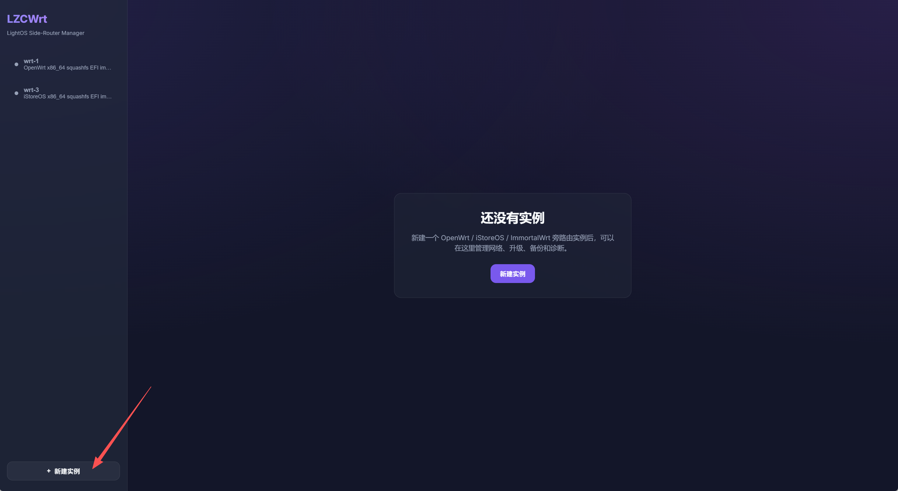

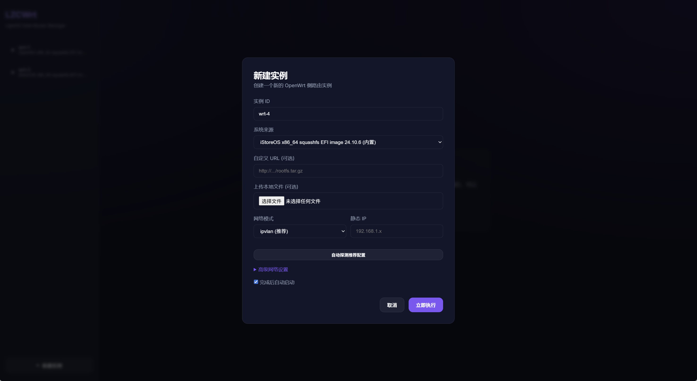

选项说明：

- 实例ID：当前创建的侧路由实例在LZCWrt中的ID
- 系统来源：在这里提供了三个内置的侧路由镜像
  - OpenWrt
    - 优点：纯官方、最稳定、适配设备极多
    - 缺点：**对小白不友好**、界面简陋、配置多、容易出错
    - 适合群体：喜欢自己折腾、要高度定制
  - ImmortalWrt
    - 优点：基于 OpenWrt，**专为中国大陆优化**，界面比原版 OpenWrt 更友好一点
    - 缺点：还是偏技术向，比 OpenWrt 简单，但不如 iStoreOS 傻瓜化
    - 适合群体：想要**功能多、稳定、国内优化好**，又不想从零编译
  - iStoreOS
    - 优点：**极度简单**：界面现代化、中文
    - 缺点：自由度最低：只能用商店里的插件
    - 适合群体：想要开箱即用、不想折腾
- 自定义URL（可选）：通过链接的方式获取侧路由镜像来运行实例
- 上传本地文件（可选）：通过上传本地已经下载好的侧路由镜像来运行实例
- 网络模式：在这里提供了三种网络模式给侧路由实例使用，目前推荐使用ipvlan模式
- 静态IP：配置当前软路由实例在当前网络下的静态IP
- 自动探测推荐配置：您可以手动设置软路由实例的静态IP，
- 高级网络设置：您可以手动设置软路由实例的网络环境，如果您对当前实例的网络环境不太了解，可以直接使用**自动探测**功能，会为您自动配置好当前实例的网络环境

## 2.iStoreOS软路由实例创建

### 2.1 创建信息填写

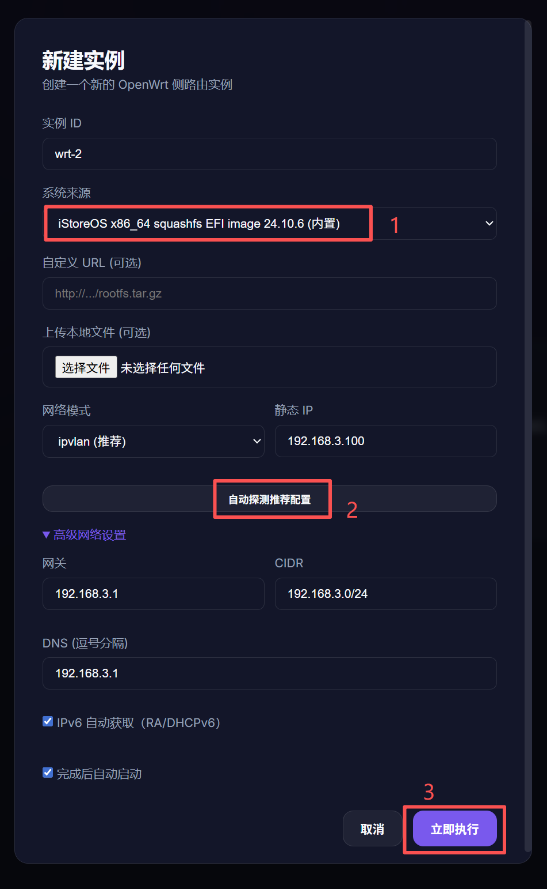

**注意：如果您对当前实例的网络环境不太了解，可以直接使用自动探测功能，会为您找到当前网络环境下空闲的IP和相关的网络配置**

### 2.2 访问 iStoreOS Web 页面

在创建好实例后，可以通过两种方式进入iStoreOS Web页面

- 点击**进入LuCI**按钮
- 复制网络配置中的IP地址，将IP地址复制到浏览器打开

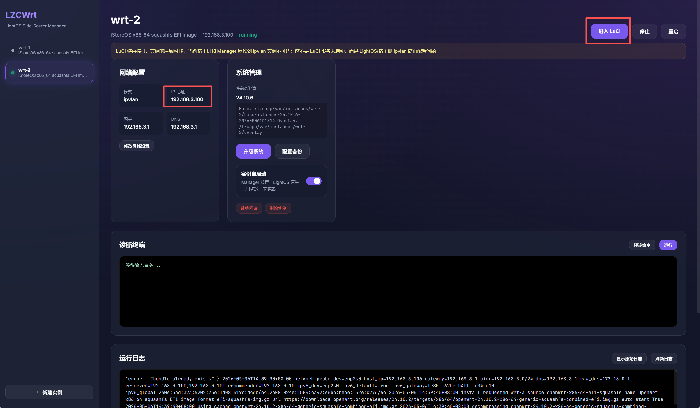

默认账号密码

- 账号：root
- 密码：root

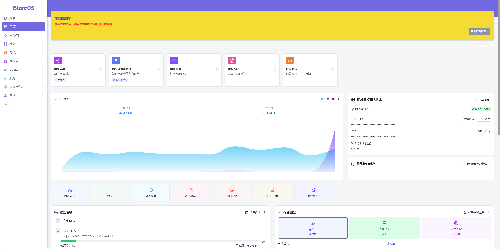

### 2.3 特别注意

**使用 iStoreOS 软路由实例时，一定不要操作和硬件有关的内容**

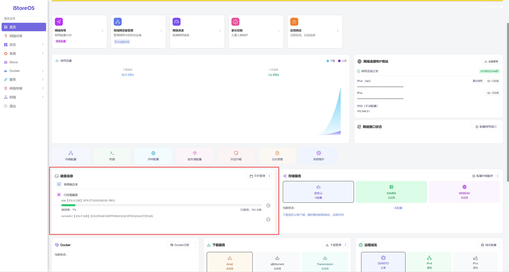

## 3.OpenWrt软路由实例创建

### 3.1 创建信息填写

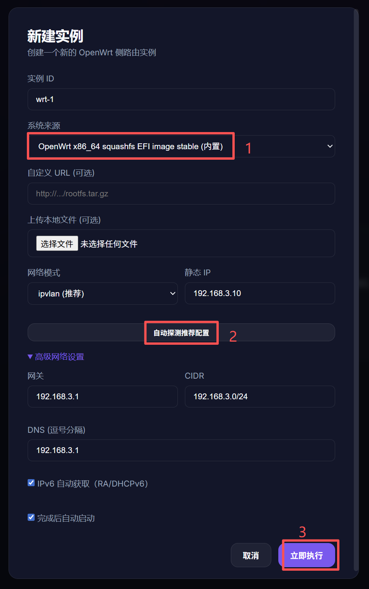

**注意：如果您对当前实例的网络环境不太了解，可以直接使用自动探测功能，会为您找到当前网络环境下空闲的IP和相关的网络配置**

### 3.2 访问 OpenWrt Web 页面

在创建好实例后，可以通过两种方式进入OpenWrt Web页面

- 点击**进入LuCI**按钮
- 复制网络配置中的IP地址，将IP地址复制到浏览器打开

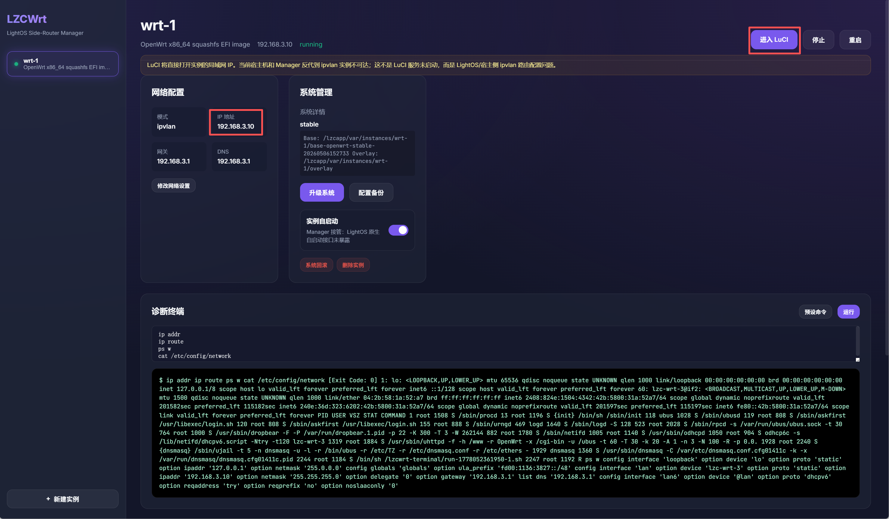

默认账号密码

- 账号：root
- 密码：root

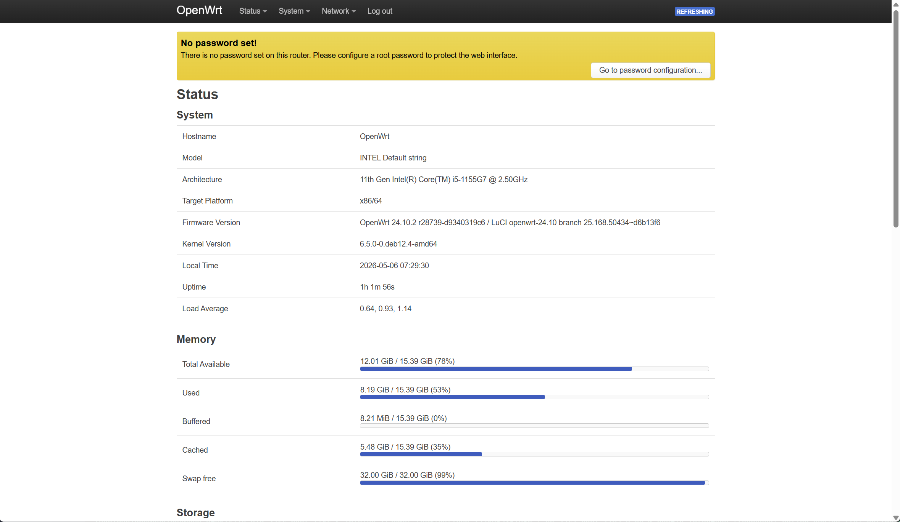

## 4.ImmortalWrt软路由实例创建

### 4.1 创建信息填写

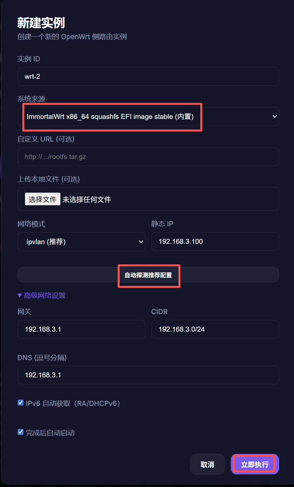

**注意：如果您对当前实例的网络环境不太了解，可以直接使用自动探测功能，会为您找到当前网络环境下空闲的IP和相关的网络配置**

### 4.2 访问 ImmortalWrt Web 页面

在创建好实例后，可以通过两种方式进入ImmortalWrt Web页面

- 点击**进入LuCI**按钮
- 复制网络配置中的IP地址，将IP地址复制到浏览器打开

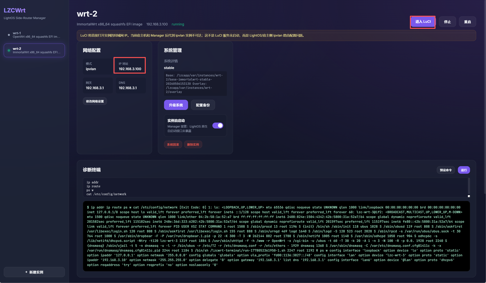

默认账号密码

- 账号：root
- 密码：root

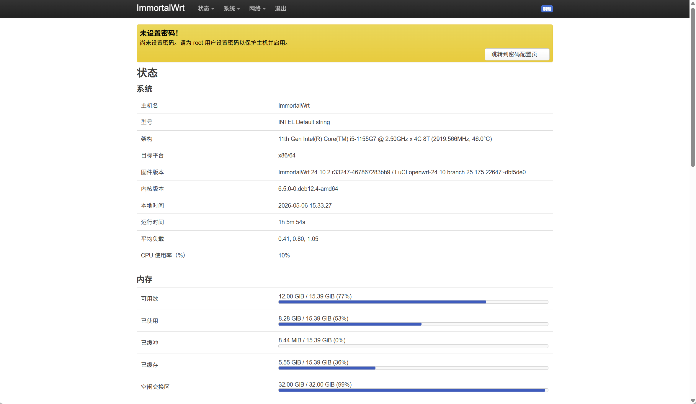